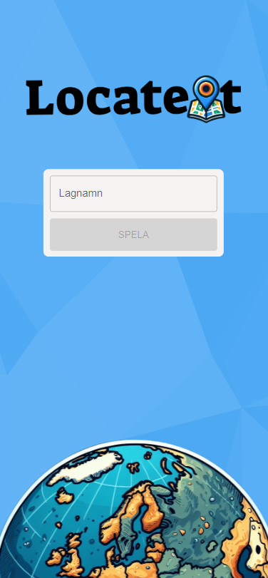
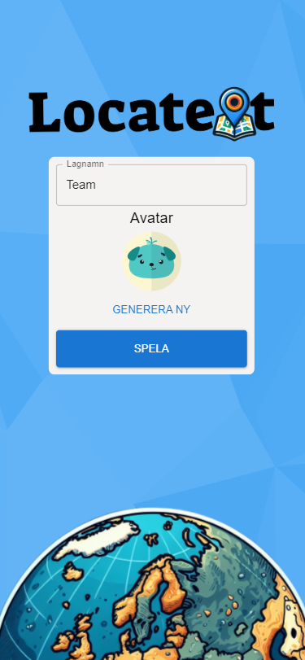
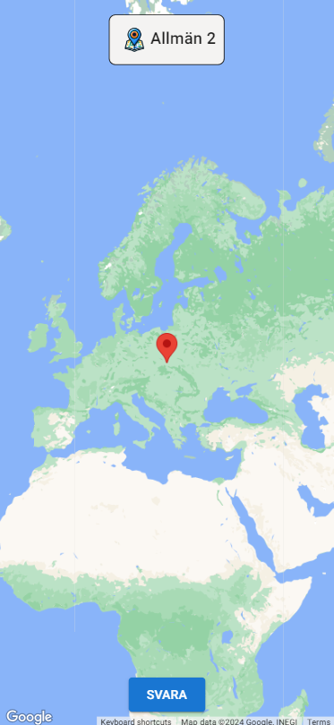
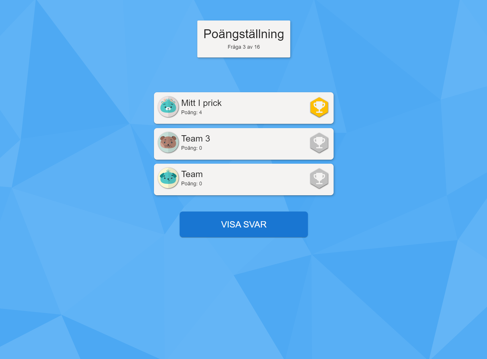
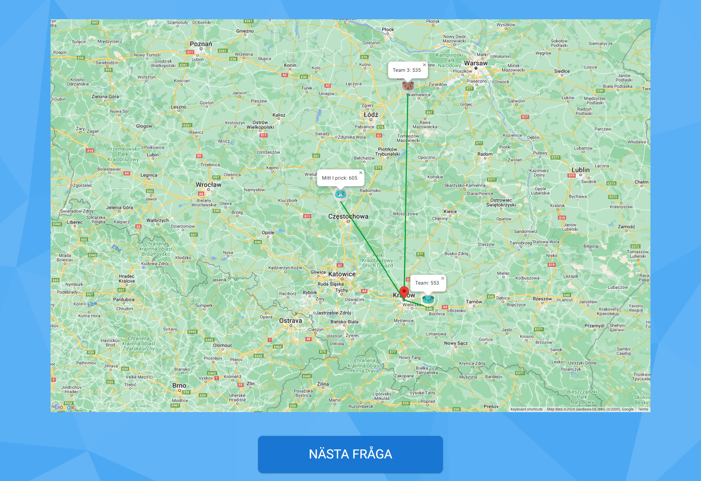
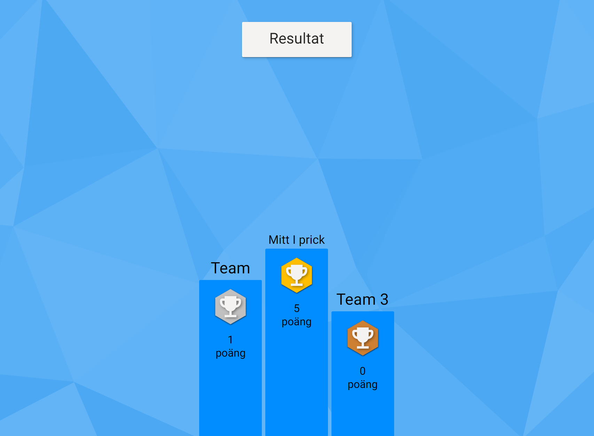

# About

This is a quiz game made with inspiration from the Swedish television show "På spåret". The players get different cities or famous places they should place on a map. The twist however is that the map contains no labels/roads/borders etc so the players have to use all their geographical knowledge to get closest to the marker!

# Screenshots

## Player screenshots

The startscreen for players. \

How the screen looks when you start typing the name, allowing you to choose an avatar. \
 \  
How it looks when the game is ongoing and you're asked to placed the marker. \

How it looks when the game is ongoing and you have placed the marker and is waiting for the answer. \

## Admin screenshots

Admin view when waiting for player answers. When a player has answered their box turns green. \

The screen that displays all the players answers aswell as the actuall location. \

How it looks when the game is finished, displaying the players and their score. \
